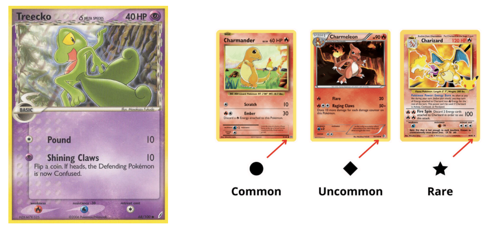
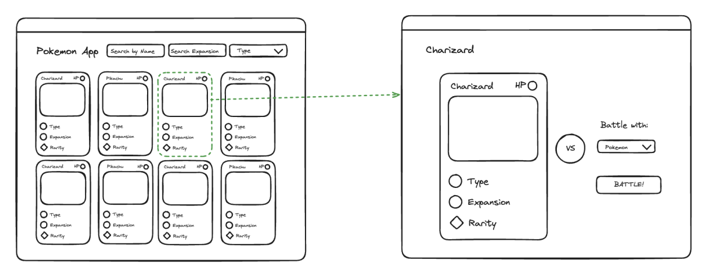

## Backend

### Scope

Develop a RESTful API centered around Pokémon Cards that can be integrated with a
frontend or application, featuring the following functionalities:

- Creation of a new card.
- Updating an existing card.
- Retrieval of a specific card.
- Retrieval of all cards.
- Deletion of a card.
- Card Battle Simulation: Given a selected card, we aim to determine whether it can defeat another card in a single attack. This assessment considers factors such as weaknesses and resistances based on types. For instance, if Feraligatr (Water) attacks Charizard, it might not initially succeed, but based on Charizard's weakness (Water) could result in a 2x damage multiplier, granting victory to Feraligatr. Conversely, consider Scizor (Steel) facing Pikachu; here, Scizor's attack might only deal 40 points of damage based on the Pikachu's resistance (20 less for Steel), rendering it unsuccessful in the battle.

- Identify Card Weaknesses and Resistances: Given a selected card, retrieve a list detailing which cards it is weak against and which it is resistant to. For example choosing Pikachu would reveal Onix as a weakness and Scizor as a resistance.

| Card       | Attack To | Original Attack | Attack Modified | Succeed |
| ---------- | --------- | --------------- | --------------- | ------- | ----- |
| Feraligatr | Charizard | (180HP)         | 160             | 320     | True  |
| Onix       | Pikachu   | (60HP)          | 40              | 80      | True  |
| Pikachu    | Onix      | (90HP)          | 20              | -       | False |
| Sneasel    | Scizor    | (120HP)         | 20              | -       | False |
| Scizor     | Pikachu   | (60HP)          | 60              | 40      | False |
| Onix       | Treecko   | (40HP)          | 40              | -       | True  |

### Notes

- The solution must be implemented in Typescript. Feel free to use any framework. (e.g., NestJS)
- Postgres must be used as the database engine.
- Feel free to make any necessary assumptions regarding required fields, data structure, and validations.
- Data persistence is required.
- The solution should be hosted in a repository.
- Upon completion, a document outlining the assumptions made, the implemented solution, and instructions for running it should be submitted.
- Documentation of the API endpoints (e.g., Swagger) should be provided.

### Bonus

- Authentication
- Filtering
- Pagination
- Unit testing
- Deployment of the API to a cloud service (AWS, Azure, Google Cloud, etc.)
- Utilization of AWS services (API Gateway, Lambda, EC2, ECS, EKS, S3, etc.)

## Frontend

### Scope

Create a view capable of displaying all available cards, alongside another view dedicated to showcasing a single selected card, with an option to engage in battles against other cards.

### Notes

- The solution must be implemented in React with Typescript. Feel free to use any framework if you want. (e.g., Next.js)
- Feel free to make any necessary assumptions regarding required fields, data structure, and validations.
- Feel free to use any library or css preprocessor. (e.g., Styled Components, Sass)
- The solution should be hosted in a repository
- Upon completion, a document outlining the assumptions made, the implemented solution, and instructions for running it

### Bonus

- Authentication
- Filtering
- Pagination
- Unit testing or e2e tests
- Deployment of the frontend
